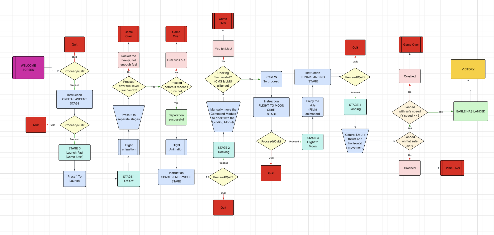

# Apollo 68K Mission

An Apollo 11 moon landing game built in Motorola 68000 assembly for the Easy68K simulator.

Fly the Saturn V through orbital ascent, dock the CSM with the Lunar Module, cruise to the Moon, and land safely on the surface — all in retro ASCII-art style.

Flowchart:

## Before You Play

Watch the trailer video: https://youtu.be/eCJLcT0Xu-k?is=AcnC1Y1tVFiOwsJs

Let all the audio clips play through before pressing any keys — the sound effects and music make the experience way cooler.

## Features

1. **4 playable phases** — launch, docking, trans-lunar flight, lunar landing
2. **Stage separation mechanics** — timed separation with fuel management
3. **Houston radio warnings** — disobey or listen, with consequences
4. **WASD docking mini-game** — collision detection, precision alignment
5. **Physics-based lunar landing** — gravity, thrust, fuel, velocity
6. **ASCII-art sprites** — Saturn V, CSM, LM, launch tower, moon surface
7. **Sound effects & music** — Sounds from real mission
8. **Multiple failure states** — fuel depletion, crash, disobeying Houston

## How to Run

1. Open `Apollo68KMission` Folder in **Easy68K** (EASy68K Editor/Assembler)
2. Run `Apollo68KMission.X68`
3. Play in **800x600** Resolution
4. Follow the on-screen instructions — each phase tells you the controls

Hope you enjoy it!
